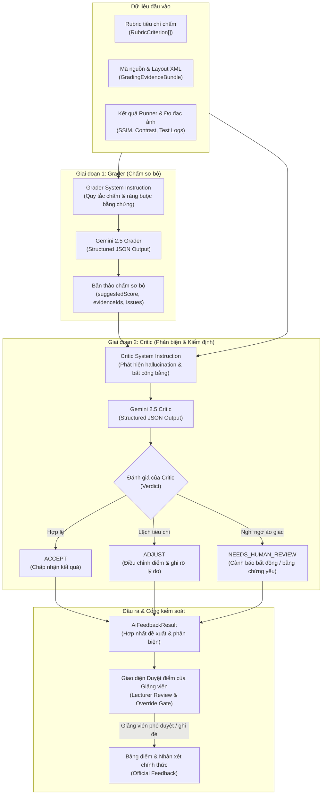

# Kiến trúc Tích hợp Trí tuệ Nhân tạo (AI Architecture v2.0)

> Tài liệu kỹ thuật chi tiết về phân hệ **Trí tuệ Nhân tạo Đa phương thức (Multimodal AI Grading Engine)** trong nền tảng **UIGrade AI**. Mô tả triết lý thiết kế, quy trình hai giai đoạn Grader-Critic, cơ chế neo bằng chứng (Evidence Grounding), và nguyên tắc con người kiểm soát (Human-in-the-Loop).
>
> Xem thêm tài liệu đặc tả quy trình chấm chi tiết cho cuộc thi tại **[AI_GRADING.md](AI_GRADING.md)**.

---

## 1. Triết lý Thiết kế: "Không Chấm Điểm Hộp Đen"

Trong giáo dục kỹ thuật phần mềm, việc sử dụng AI như một "hộp đen" (Black-box) tự động đưa ra một con số điểm mà không có bằng chứng là không thể chấp nhận. UIGrade AI áp dụng triết lý ba tầng:

1. **Deterministic First**: Mọi yếu tố có thể kiểm tra một cách toán học hoặc kỹ thuật (tính tồn tại của tệp, biên dịch mã, kiểm thử đơn vị, độ tương phản màu WCAG, chỉ số sai khác ảnh SSIM/MSE) phải do Runner tất định xử lý.
2. **Multimodal AI Grounding**: AI chỉ tham gia vào các khía cạnh đòi hỏi hiểu biết ngữ nghĩa (chất lượng tổ chức mã, tính trực quan của bố cục UI, sự hợp lý của kiến trúc giao diện), và bắt buộc phải **trích dẫn mã định danh bằng chứng (Evidence IDs)** cụ thể.
3. **Human-in-the-Loop Always**: Đề xuất của AI ở trạng thái sơ bộ (`needs_teacher_review`). Giảng viên luôn nắm quyền kiểm soát tối cao, có thể duyệt, sửa đổi hoặc ghi đè (override) bất kỳ tiêu chí nào trước khi công bố cho sinh viên.

---

## 2. Mô hình Quy trình Hai Giai đoạn (Grader-Critic Pipeline)

Phân hệ AI trong UIGrade AI v2.0 (`web/site/services/ai-grading-v2.service.ts`) được xây dựng trên kiến trúc phân tách trách nhiệm giữa hai thực thể: **Grader (Người chấm)** và **Critic (Người phản biện)**.



---

## 3. Các Thành phần Cốt lõi (Core Subsystems)

### 3.1. Bộ Phân tích Rubric Tự động (`rubric-parser.service.ts`)
Giảng viên thường nhập tiêu chí đánh giá dưới dạng văn bản tự nhiên hoặc danh sách gạch đầu dòng. `rubric-parser.service.ts` chịu trách nhiệm:
- Chuẩn hoá văn bản thành danh sách `RubricCriterion[]` có cấu trúc nghiêm ngặt.
- Tự động phân loại nguồn đánh giá (`gradingSource`):
  - `runner`: Tiêu chí về cấu trúc tệp, build, test tự động.
  - `ai`: Tiêu chí về trải nghiệm người dùng, thiết kế giao diện, tổ chức mã.
  - `hybrid`: Tiêu chí kết hợp đo đạc số liệu kỹ thuật và đánh giá thẩm mỹ.
  - `manual`: Tiêu chí yêu cầu giáo viên trực tiếp chấm.
- Cân bằng lại tổng điểm (`rebalanceRubricPoints`) bảo đảm tổng điểm thành phần luôn khớp chính xác với thang điểm tối đa của bài tập (ví dụ 10.0 hoặc 100).

### 3.2. Đóng gói Bằng chứng Đa phương thức (`grading-evidence.service.ts`)
Trước khi gửi dữ liệu cho mô hình, hệ thống đóng gói toàn bộ dữ liệu thành một `GradingEvidenceBundle`:
- **Evidence IDs**: Mỗi tệp tin, đoạn mã quan trọng, ảnh giao diện, dòng log runner đều được gán một định danh duy nhất (ví dụ: `code:activity_main.xml`, `metric:ssim_score`, `runner:manifest_check`).
- **Multimodal Parts**: Ảnh chụp bài nộp của sinh viên và ảnh đối chiếu chuẩn được gửi dạng Base64 Inline Parts qua API của Gemini.
- **Evidence Status**: Hệ thống phân loại trạng thái bằng chứng:
  - `verified`: Đã kiểm chứng đầy đủ bằng tệp thực tế hoặc log runner.
  - `insufficient`: Có dấu hiệu nhưng dữ liệu chưa đủ khẳng định.
  - `missing`: Không tìm thấy tệp hoặc bằng chứng yêu cầu trong bài nộp.

### 3.3. Ràng buộc Lược đồ Dữ liệu (Strict JSON Schema & Zod Validation)
Để triệt tiêu lỗi cú pháp và đảm bảo tính dự đoán được, API yêu cầu Gemini xuất dữ liệu theo JSON Schema chuẩn:
```typescript
// Định nghĩa lược đồ tiêu chí do AI chấm
const graderCriterionSchema = z.object({
    criterionCode: z.string().trim().min(1),
    suggestedScore: z.number().finite(),
    confidence: z.number().finite().min(0).max(1),
    evidenceIds: z.array(z.string().trim().min(1)).max(12),
    evidenceStatus: z.enum(["verified", "insufficient", "missing"]),
    summary: z.string().trim().min(1).max(3000),
    strengths: z.array(z.string().trim().min(1).max(1000)).max(12),
    issues: z.array(z.string().trim().min(1).max(1000)).max(12),
    suggestions: z.array(z.string().trim().min(1).max(1000)).max(12),
});
```

---

## 4. Chống Ảo giác & Đo lường Độ tin cậy (Hallucination Mitigation)

| Cơ chế | Cách hoạt động | Tác dụng |
|---|---|---|
| **Bắt buộc Evidence IDs** | Grader và Critic bắt buộc phải trích dẫn định danh có trong `evidenceIds` | Ngăn chặn AI tự bịa ra lỗi hoặc tính năng sinh viên không có |
| **Đánh giá mức tin cậy (Confidence)** | Hệ thống phân nhóm: Cao (≥ 0.85), Trung bình (≥ 0.65), Thấp (< 0.65) | Tự động cảnh báo giáo viên đối với các tiêu chí độ tin cậy thấp |
| **Phản biện độc lập (Critic Step)** | Lần gọi mô hình thứ 2 rà soát lại kết luận của Grader | Phát hiện trường hợp Grader thiên vị hoặc chấm sai lệch tiêu chí |
| **Fallback an toàn** | Nếu mất kết nối mạng hoặc hết quota API, trả về điểm runner tất định | Không làm gián đoạn tiến trình chấm bài của hệ thống |

---

## 5. Vai trò của Giảng viên (Human-in-the-Loop Safeguards)

Toàn bộ kết quả do AI sinh ra được định danh là **"Khuyến nghị đánh giá" (Suggested Evaluation)** chứ không phải "Điểm chính thức".

1. **Trạng thái bài nộp**: Khi hoàn tất chấm máy, trạng thái bài nộp là `needs_teacher_review`.
2. **Giao diện Workbench dành cho Giảng viên**:
   - Hiển thị song song ảnh chụp màn hình bài nộp và ảnh chuẩn thiết kế.
   - Hiển thị nhận xét, các bằng chứng trích dẫn và điểm đề xuất của AI.
   - Cung cấp ô nhập điểm ghi đè (`overrideScore`) và nhận xét bổ sung của giáo viên cho từng tiêu chí.
3. **Lưu vết kiểm toán (Audit Trail)**: Hệ thống ghi nhận cả hai giá trị: điểm do AI đề xuất ban đầu và điểm chính thức do giáo viên phê duyệt, bảo đảm tính minh bạch trong toàn bộ quá trình đào tạo.

---

## 6. Dữ liệu Nghiên cứu Thực nghiệm & Giới hạn đã biết

Trong quá trình nghiên cứu và thử nghiệm (theo đề cương NCKH và tài liệu `docs/04_KET_QUA_CAP_NHAT_TU_DU_AN_NEN.md`):
- Khi thử nghiệm các mô hình ngôn ngữ nhỏ (SLM - Small Language Models) như Qwen2.5-0.5B hoặc các mô hình on-device trên bài toán chấm UI tự động, độ chính xác chỉ đạt khoảng **27% - 33%** do giới hạn về năng lực suy luận không gian và hiểu cấu trúc XML/Compose phức tạp.
- Nhóm dự án UIGrade AI chủ động công bố thực tế này thay vì tiếp thị sai lệch: **Mô hình nhỏ hiện chưa đủ độ tin cậy để tự động chấm điểm độc lập**, do đó hệ thống lựa chọn kiến trúc kết hợp:
  - Sử dụng mô hình đa phương thức tiên tiến (Gemini Multimodal) ở phía máy chủ kết hợp kiểm tra tất định bằng mã nguồn.
  - Duy trì sự kiểm soát của con người là điều kiện tiên quyết.
