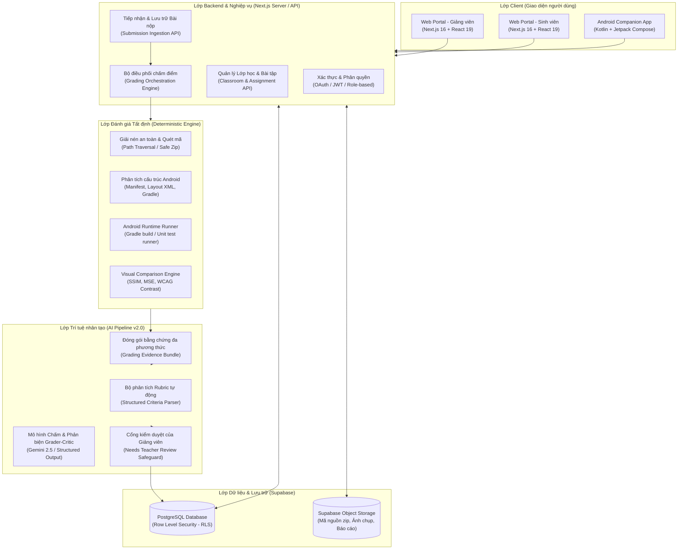
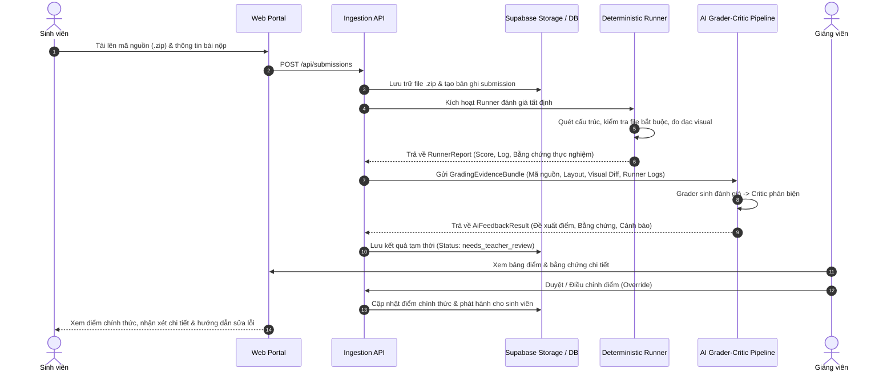

# Kiến trúc hệ thống UIGrade AI (System Architecture)

> Tài liệu mô tả kiến trúc tổng thể của nền tảng **UIGrade AI** — Hệ sinh thái đánh giá giao diện người dùng và chấm bài tập lập trình Android tự động, kết hợp kiểm tra tất định (Deterministic Runner) và mô hình ngôn ngữ lớn/đa phương thức (Multimodal AI).

---

## 1. Tổng quan hệ thống (High-Level Overview)

UIGrade AI được thiết kế theo kiến trúc module hoá hiện đại, phân tách rõ ràng giữa lớp giao diện (Web/Mobile), lớp dịch vụ nghiệp vụ (Next.js App Router API), lớp dữ liệu/lưu trữ (Supabase PostgreSQL & Storage), lớp thực thi kiểm tra tất định (Static & Runtime Runner) và lớp trí tuệ nhân tạo (Multimodal AI Pipeline).



---

## 2. Các tầng thành phần (System Layers)

### 2.1. Lớp Client (Client Layer)
- **Web Application (`web/site`)**:
  - Xây dựng trên **Next.js 16 (App Router)**, **React 19**, và **Tailwind CSS v4**.
  - Hỗ trợ đầy đủ hai vai trò người dùng chính: **Giảng viên (Lecturer)** và **Sinh viên (Student)**.
  - Tối ưu hoá hiển thị đáp ứng (Responsive Design), hỗ trợ Dark/Light mode, giao diện tinh gọn, không phụ thuộc thư viện UI cồng kềnh.
- **Android Companion App (`app/`)**:
  - Ứng dụng di động viết bằng **Kotlin** với **Jetpack Compose** và **Material 3**.
  - Cho phép sinh viên tra cứu lớp học, xem bài tập, kiểm tra kết quả chấm và lịch sử nộp bài trực tiếp trên thiết bị Android.

### 2.2. Lớp Backend & Dịch vụ (Backend & Services Layer)
- **Next.js App Router API Routes (`web/site/app/api/*`)**:
  - `auth/`: Đăng nhập, đăng ký, phiên làm việc, callback Google OAuth.
  - `classes/`: Quản lý lớp học, mã tham gia (invite code), danh sách thành viên.
  - `assignments/`: Tạo và cấu hình bài tập, thiết lập Rubric, cấu hình Runner.
  - `submissions/`: Tiếp nhận file `.zip`, metadata bài nộp, kiểm tra định dạng và kích thước.
  - `grading/`: Kích hoạt tiến trình chấm, lưu trữ kết quả, xử lý duyệt/ghi đè điểm từ giảng viên.
  - `rubric/`: Hỗ trợ sinh và phân tích Rubric tiêu chí từ văn bản thô.

### 2.3. Lớp Đánh giá Tất định (Deterministic Runner Engine)
Toàn bộ mã nguồn bài nộp trước tiên phải đi qua bộ kiểm tra tất định, không dựa vào AI để đảm bảo tính khách quan và có thể tái lập (Reproducible):
1. **Safe Zip Extraction**: Kiểm tra an toàn tệp nén, ngăn chặn lỗ hổng Zip Slip và Path Traversal (`runner.service.ts`).
2. **Static Structure Analyzer**: Quét cây thư mục bài nộp, đối chiếu sự tồn tại của `AndroidManifest.xml`, các tệp layout `.xml`, `build.gradle`, và mã nguồn Kotlin/Java.
3. **Android Runtime Runner**: Hỗ trợ thực thi kiểm thử tự động, build dự án mẫu và phân tích log thực thi (`android-runtime-runner.service.ts`).
4. **Visual Comparison Engine**: Đo lường sự sai khác giao diện giữa bài làm sinh viên và giao diện mẫu thông qua các chỉ số định lượng: SSIM (Structural Similarity Index), MSE (Mean Squared Error), và độ tương phản màu sắc đạt chuẩn WCAG (`visual-comparison.service.ts`).

### 2.4. Lớp AI Chấm điểm & Phản hồi (Multimodal AI Pipeline v2.0)
- Tích hợp mô hình ngôn ngữ lớn đa phương thức (**Google Gemini**) qua SDK chuẩn `@google/genai`.
- Kiến trúc **Grader-Critic kép**: Một mô hình đề xuất điểm kèm bằng chứng (`grader`), một mô hình phản biện tính nhất quán và phát hiện hallucination (`critic`).
- **Nguyên tắc "Human-in-the-Loop"**: AI không tự ý chốt điểm chính thức. Mọi tiêu chí chấm bằng AI đều yêu cầu trạng thái `needs_teacher_review`, bảo đảm giảng viên luôn là người quyết định cuối cùng.

### 2.5. Lớp Dữ liệu & Lưu trữ (Data & Persistence Layer)
- **Supabase PostgreSQL**:
  - Lưu trữ thông tin người dùng, lớp học, bài tập, rubric, bài nộp, kết quả chấm điểm từng tiêu chí.
  - Bảo vệ dữ liệu với chính sách **Row-Level Security (RLS)**: sinh viên chỉ đọc bài của mình; giảng viên quản lý lớp do mình phụ trách.
- **Supabase Storage**:
  - Lưu trữ tệp mã nguồn nén (`.zip`), ảnh chụp giao diện bài làm, ảnh tham chiếu mẫu và các tệp đính kèm.

---

## 3. Quy trình xử lý dữ liệu chính (Core Data Flows)

### 3.1. Quy trình Nộp bài & Chấm bài tự động (Submission & Grading Pipeline)



---

## 4. Kiến trúc Bảo mật & Cô lập (Security & Isolation)

| Hạng mục | Cơ chế thực hiện | Mục tiêu bảo vệ |
|---|---|---|
| **Xác thực danh tính** | Supabase Auth + Google OAuth 2.0 + HTTP-only Cookie / Session Token | Chống tấn công giả mạo phiên, bảo vệ thông tin người dùng |
| **Phân quyền dữ liệu** | PostgreSQL Row-Level Security (RLS) + Middleware kiểm tra vai trò | Ngăn chặn học sinh truy cập bài nộp hoặc điểm của học sinh khác |
| **An toàn giải nén** | Quét đường dẫn chuẩn hoá (`normalizePath`), chặn `../` và ký tự lạ | Chống lỗ hổng Zip Slip và tấn công ghi đè tệp hệ thống |
| **Kiểm soát đầu ra AI** | Zod Schema Validation + JSON Schema Mode | Đảm bảo phản hồi của LLM luôn đúng định dạng, không vỡ cấu trúc |
| **Quản lý khóa bảo mật** | Biến môi trường (`.env.local`), không commit khóa lên git | Chống rò rỉ Service Role Key, Gemini API Key |

---

## 5. Cấu trúc thư mục nguồn (Repository Layout)

```text
UIGrade-AI/
├── app/                        # Ứng dụng Android Companion (Kotlin, Jetpack Compose)
├── docs/                       # Tài liệu kiến trúc, hướng dẫn kỹ thuật & đặc tả
│   ├── ARCHITECTURE.md         # Tài liệu kiến trúc hệ thống tổng thể (Tệp này)
│   ├── AI_ARCHITECTURE.md      # Tài liệu kiến trúc chi tiết phân hệ AI
│   └── superpowers/            # Kế hoạch và đặc tả phát triển chuyên sâu
├── web/
│   ├── site/                   # Web Application chính (Next.js 16 + React 19)
│   │   ├── app/                # App Router (Trang giao diện & API endpoints)
│   │   ├── components/         # React Components (UI, Auth, Classroom, Grading)
│   │   ├── lib/                # Thư viện tiện ích, Grading Contract, Supabase clients
│   │   ├── services/           # Nghiệp vụ backend (Runner, AI v2, Supabase services)
│   │   └── public/             # Tài nguyên tĩnh
│   └── project-files/          # Tài liệu đề cương, sổ tay dữ liệu nghiên cứu khoa học
├── LICENSE                     # Giấy phép nguồn mở MIT
├── NOTICE.md                   # Thông cáo bản quyền và cấu phần bên thứ ba
├── CONTRIBUTING.md             # Hướng dẫn đóng góp mã nguồn
├── CODE_OF_CONDUCT.md          # Bộ quy tắc ứng xử cộng đồng
└── SECURITY.md                 # Chính sách bảo mật & báo cáo lỗ hổng
```
