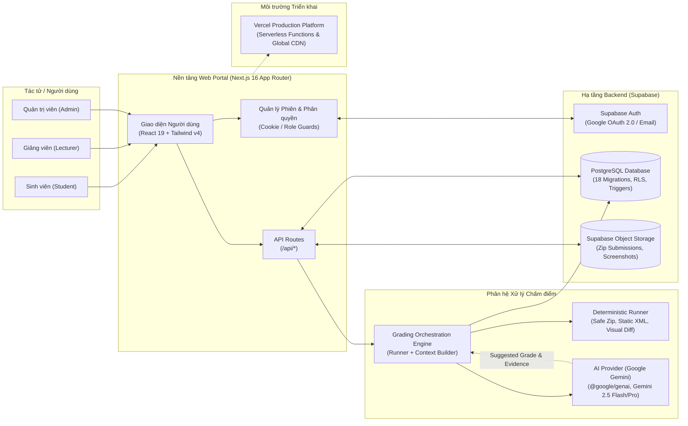
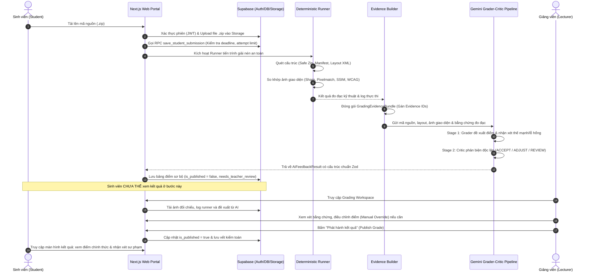

# Kiến Trúc Hệ Thống UIGrade AI (System Architecture)

> **Tài liệu kiến trúc hệ thống chính thức tham gia Cuộc thi "Phát triển phần mềm mã nguồn mở tích hợp AI 2026"**
>
> *Dự án: UIGrade AI — Hệ sinh thái Đánh giá Giao diện Người dùng và Chấm bài Lập trình Android Tích hợp Trí tuệ Nhân tạo Đa phương thức*

---

## 1. Sơ Đồ Kiến Trúc Tổng Thể (High-Level Architecture)

Kiến trúc UIGrade AI được xây dựng theo mô hình phân tầng module hoá, phân định rõ ràng giữa tầng giao diện người dùng, tầng định tuyến và nghiệp vụ máy chủ, tầng phân quyền và dữ liệu, tầng đánh giá tất định, và tầng trí tuệ nhân tạo đa phương thức.

---

## 2. Chi Tiết Các Tầng Kỹ Thuật (Technology Stack Breakdown)

### 2.1. Frontend & Client Layer
- **Framework:** **Next.js 16.2 (App Router)** kết hợp **React 19.2**.
- **Ngôn ngữ:** **TypeScript 5.x** với cấu hình type-check nghiêm ngặt (`tsc --noEmit` đạt 0 lỗi).
- **Styling & UI:** **Tailwind CSS v4** với `@tailwindcss/postcss`. Thiết kế giao diện theo phong cách Soft UI / Modern EdTech, tối ưu tương phản WCAG, hỗ trợ đầy đủ Dark/Light theme.
- **Biểu đồ & Hiển thị:** **Recharts 3.8** (thống kê phổ điểm, độ tương đồng trực quan), **React Markdown 10.1** (kết xuất nhận xét định dạng), **Lucide React** (bộ biểu tượng giao diện).
- **Android Companion App (`app/`):** Ứng dụng Android native viết bằng **Kotlin 2.0**, **Jetpack Compose BOM 2024.12**, **Hilt DI**, và **Material 3**.

### 2.2. Authentication & Session Management
- **Nhà cung cấp xác thực:** **Supabase Auth** tích hợp **Google OAuth 2.0** và xác thực mật khẩu.
- **Bảo mật phiên làm việc (Session Security):**
  - Quản lý phiên qua **HTTP-only Cookie** an toàn, chống tấn công XSS đánh cắp token.
  - Xử lý chuyển hướng OAuth thông minh qua `proxy.ts` (Next.js Middleware), bảo đảm không bị lặp chuyển hướng (redirect loop) và nhận diện chính xác origin callback giữa môi trường cục bộ và production.
- **Ràng buộc học thuật:** Quy định email đăng ký tài khoản phải thuộc tên miền giáo dục `.edu.vn` (kiểm tra ở cả frontend validation và database trigger).
- **Luồng Onboarding chọn vai trò:** Người dùng đăng nhập lần đầu được chuyển hướng đến `/auth/select-role` để thiết lập vai trò ban đầu (`student` hoặc `lecturer`), ngăn chặn tình trạng tài khoản vô danh.

### 2.3. Database & Persistence Layer (Supabase PostgreSQL)
- **Hệ quản trị CSDL:** **PostgreSQL 15+** được lưu trữ trên nền tảng Supabase.
- **Quản lý phiên bản Schema:** Hệ thống quản lý toàn bộ cấu trúc qua **18 tệp migration SQL** tuần tự (`web/site/supabase/migrations/`).
- **Row-Level Security (RLS):**
  - Kích hoạt RLS trên 100% các bảng nhạy cảm: `profiles`, `classes`, `class_members`, `assignments`, `submissions`, `grading_results`, `system_configs`.
  - Quy tắc phân lập dữ liệu: Sinh viên chỉ được đọc bài nộp của chính mình; Giảng viên chỉ được quản lý lớp và chấm bài do mình giảng dạy; Bảng điểm chỉ hiển thị với sinh viên khi đã được giảng viên `publish`.
- **Database Functions & Triggers:**
  - `save_student_submission`: Hàm `SECURITY DEFINER` kiểm soát số lần nộp bài (submission attempts) và ghi nhận timestamp chống gian lận thời gian.
  - `trg_prevent_self_role_escalation`: Trigger chặn người dùng tự động leo quyền sửa đổi trường `role` của chính mình.
  - `trg_protect_last_admin`: Trigger sử dụng PostgreSQL Advisory Locks (`pg_advisory_xact_lock`) tuần tự hóa giao dịch, ngăn chặn tuyệt đối việc xóa, hạ quyền, hoặc khóa Admin cuối cùng của hệ thống.

### 2.4. Storage Layer (Supabase Object Storage)
- **Bucket `submissions`:** Lưu trữ tệp mã nguồn nén `.zip` của sinh viên. Quyền truy cập được kiểm soát thông qua Signed URLs và quyền sở hữu bài nộp.
- **Bucket `baseline-images`:** Lưu trữ ảnh chụp giao diện chuẩn do giảng viên tải lên làm căn cứ chấm bài.
- **Bucket `runner-artifacts`:** Lưu trữ ảnh chụp thực tế từ bài làm sinh viên, ảnh sai khác trực quan (`diff.png`), và các tệp báo cáo kỹ thuật.

### 2.5. Authorization & Application Security Guards
Hệ thống áp dụng cơ chế bảo vệ phân quyền hai lớp (Defense-in-Depth):
1. **Lớp 1 (Database Layer):** PostgreSQL Row Level Security (RLS) ngăn chặn rò rỉ dữ liệu ngay cả khi có truy vấn trực tiếp qua API client.
2. **Lớp 2 (Application Layer):** Các bộ bảo vệ tập trung trong `web/site/lib/authorization.ts` và `proxy.ts`:
   - `requireAuthUser`: Bắt buộc người dùng đã đăng nhập và tài khoản ở trạng thái `active`.
   - `requireStudent`: Kiểm tra quyền sinh viên khi nộp bài hoặc xem kết quả.
   - `requireLecturer`: Kiểm tra quyền giảng viên khi tạo lớp, tạo bài tập, cấu hình rubric, và chấm bài.
   - `requireAdmin`: Kiểm tra quyền quản trị tối cao khi quản lý người dùng và cấu hình hệ thống.

### 2.6. AI Engine & Provider
- **Nhà cung cấp:** **Google Gemini API** thông qua SDK chính thức `@google/genai` và `@google/generative-ai`.
- **Mô hình triển khai:** `gemini-2.5-flash` (ưu tiên tốc độ và chi phí) và `gemini-2.5-pro` (đánh giá chuyên sâu).
- **Ràng buộc đầu ra:** Sử dụng **Structured JSON Output** kết hợp kiểm thực cấu trúc bằng **Zod Schema** tại tầng runtime.
- **Cơ chế Fallback an toàn:** Nếu mất kết nối hoặc hết quota API AI, hệ thống tự động giữ nguyên kết quả đo đạc tất định từ Runner và chuyển bài nộp sang hàng đợi chờ giảng viên chấm thủ công, không gây gián đoạn hệ thống.

### 2.7. Deployment & Infrastructure
- **Nền tảng triển khai Web:** **Vercel** (Edge Network và Node.js Serverless Runtime).
- **Cấu hình Vercel (`web/site/vercel.json`):** Tối ưu hóa thời gian chạy tối đa (maxDuration 60 giây) cho các API endpoint xử lý tác vụ nặng như giải nén và gọi mô hình AI.
- **Live Demo:** Hệ thống đang hoạt động công khai tại [https://site-truong257.vercel.app](https://site-truong257.vercel.app).

---

## 3. Sơ Đồ Luồng Dữ Liệu Chấm Điểm (Grading Data Flow)

---

## 4. Bản Đồ Tuyến API (API Route Architecture)

Hệ thống Next.js App Router cung cấp 53 route được cấu trúc phân định theo nghiệp vụ:

| Tiền tố Tuyến (Route Prefix) | Chức năng Chính | Quyền Hạn (Role Guards) |
|---|---|---|
| `/api/auth/*` | Đăng nhập, đăng ký, đăng xuất, lấy thông tin cá nhân (`/me`), đổi vai trò onboarding (`/set-role`) | Public / Authenticated |
| `/api/classes/*` | Tạo lớp, quản lý sinh viên, tìm kiếm học viên, tham gia lớp qua mã mời (`/join`) | Lecturer / Student |
| `/api/assignments/*` | Tạo bài tập, cấu hình Rubric, tải ảnh UI baseline, cấu hình runner kiểm thử | Lecturer / Authenticated |
| `/api/submissions/*` | Nộp bài (.zip), xem lịch sử nộp bài, ghi đè điểm số | Student / Lecturer |
| `/api/grading/*` | Kích hoạt chấm bài, gọi AI gợi ý (`/ai-suggest`), lưu bản nháp, xuất bản điểm (`/publish`) | Lecturer |
| `/api/reports/*` | Báo cáo phân tích học tập, tóm tắt AI về tình hình tiếp thu của lớp (`/ai-summary`) | Lecturer / Admin |
| `/api/settings/users/*` | Quản trị người dùng, khóa tài khoản, phân vai trò, bảo vệ Last-Admin | Admin |
| `/api/server-config/*` | Cấu hình máy chủ, thiết lập SMTP thông báo, kiểm tra gửi email | Admin |

---

## 5. Kiến Trúc Bảo Mật Phòng Thủ Theo Chiều Sâu (Defense-in-Depth)

| Lớp bảo vệ (Defense Layer) | Kỹ thuật áp dụng | Mối đe dọa được triệt tiêu |
|---|---|---|
| **Mạng & Định tuyến** | Next.js Middleware (`proxy.ts`), HSTS, Cookie HTTP-only, CORS an toàn | Tấn công Man-in-the-middle, XSS đánh cắp phiên làm việc |
| **Xác thực người dùng** | Supabase Auth, Google OAuth 2.0, Ràng buộc đuôi email `.edu.vn` | Giả mạo danh tính, tạo tài khoản rác hàng loạt |
| **Giải nén tệp nộp** | Chuẩn hóa đường dẫn (`path.normalize`), kiểm tra Path Traversal, chặn tệp độc | Tấn công Zip Slip, ghi đè tệp nhị phân trên máy chủ |
| **Kiểm soát truy cập dữ liệu** | PostgreSQL Row-Level Security (RLS) trên từng bảng | Tấn công IDOR (Insecure Direct Object Reference), đọc trộm bài của người khác |
| **Tránh rò rỉ điểm số** | Cờ `is_published` được bảo vệ ở cả RLS policy và API endpoint | Sinh viên xem điểm trước khi giảng viên phê duyệt |
| **Bảo vệ tính toàn vẹn Admin** | Trigger `trg_protect_last_admin` với khóa cố vấn transaction | Tình huống vô tình hoặc cố ý xóa sạch quyền quản trị hệ thống |
| **Kiểm soát đầu ra AI** | Zod Schema Validation, JSON Schema Enforced Mode | Lỗi cú pháp LLM, mã độc chèn qua prompt injection |
