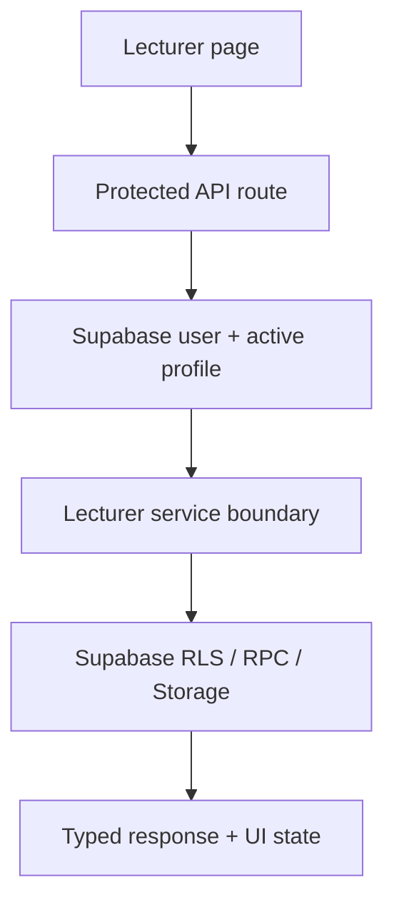

# Web Lecturer Flow Completion Design

## Goal

Deliver a production-ready lecturer journey for UIGrade AI Web from authentication through class and assignment management to grading and publishing results. Every lecturer action must have visible feedback, server-side authorization, Supabase enforcement, and regression coverage.

## Scope

This work covers only the Web application and Web-facing Supabase contracts:

- Lecturer dashboard and role-aware navigation.
- Class creation, editing, join-code handling, membership review, and student removal.
- Assignment creation, draft/publish lifecycle, editing, deletion, rubric configuration, runner configuration, and UI baselines.
- Submission discovery, student filtering, secure file preview, grading drafts, AI suggestions, manual scoring, publishing, and grading history.
- Lecturer account/profile experience where it intersects the journey.
- API, service, validation, route guard, RLS/RPC, and automated test coverage supporting those flows.

Android, Admin feature expansion, Student feature expansion, billing, messaging, and new analytics products are outside scope. Existing shared components may be changed only when required by the lecturer journey without weakening other roles.

## Current State

The repository already contains the main lecturer pages and Supabase services:

- `/ui/dashboard`
- `/ui/my_classes`
- `/ui/assignment_list`
- `/ui/create_assignment` and the existing create-assignment implementation
- `/ui/grading_detail`
- `/ui/account`
- `/api/classes/**`, `/api/assignments/**`, `/api/grading/**`, and supporting Supabase services

The initial lecturer/security regression set passes, and the full Web baseline is 357 passing tests. The remaining risk is integration quality: duplicated role vocabulary, pages that fetch several resources independently, inconsistent loading/error handling, weak end-to-end UI coverage, and possible gaps between shared page permissions and mutation permissions.

## Canonical Role Boundary

`lecturer` is the only lecturer role used by UI state, navigation, route guards, API authorization, and new tests. The legacy value `teacher` may be accepted only at an explicit compatibility boundary that reads historical data and immediately normalizes it to `lecturer`.

No new component, API payload, database write, or profile update will produce `teacher`. Display copy uses the Vietnamese label `Giảng viên` and never exposes internal role names.

## Lecturer Journeys

### 1. Authentication and Navigation

After a confirmed, active lecturer signs in, the server resolves the Supabase user and authoritative profile before rendering protected pages. The lecturer lands on `/ui/dashboard` and sees only lecturer navigation: dashboard, classes, assignments, grading, and account.

Student-only pages and Admin configuration remain inaccessible even if entered directly. An unauthenticated session redirects to login; a pending or inactive profile receives a clear blocked-state message rather than partial page content.

### 2. Dashboard

The dashboard summarizes only resources owned by the current lecturer:

- Number of owned classes and active students.
- Assignment counts by lifecycle state.
- Submitted, ungraded, draft-graded, and published work.
- Recent activity and time-based charts derived from the same authorized dataset.

The page exposes loading, empty, partial-error, and retry states. A range change cancels or ignores stale requests so an older response cannot replace a newer selection.

### 3. Class Management

A lecturer can create and edit only their own classes. The class code is generated or validated server-side, shown with an explicit copy action, and cannot be silently overwritten by duplicate submissions.

The class detail experience includes active/pending membership, student identity, student code, and safe membership actions. Adding, approving, changing membership state, or removing a student returns a visible result and refreshes the affected class without forcing a full-page reload.

Ownership is enforced at the API/service layer and by Supabase policies. A lecturer cannot enumerate, mutate, or infer another lecturer's classes or membership.

### 4. Assignment Management

The lecturer can create an assignment for an owned class, save it as a draft, publish it, edit it, or delete it when allowed by the established lifecycle rules. Required fields, dates, maximum score, submission policy, rubric totals, attachments, runner configuration, and UI baselines are validated before mutation.

The creation experience has one canonical route. Existing duplicate route implementations are traced and either redirected to the canonical page or reduced to a shared implementation so fixes do not diverge.

Mutating controls disable while a request is active and reject repeated clicks. Successful mutations show confirmation and navigate or refresh predictably. Failed mutations retain user input and display Vietnamese error copy close to the relevant action.

### 5. Submission and Grading Workspace

The grading workspace begins with the lecturer's assignments and submissions, not a cross-tenant global list. Selecting an assignment loads its active students and current submissions. Filters distinguish not submitted, submitted, draft graded, and published.

For a selected submission, the lecturer can:

- Inspect submitted text, repository metadata, and authorized signed file URLs.
- Review rubric criteria and deterministic evidence.
- Request an AI suggestion when a rubric exists and the result is not already published.
- Edit criterion scores, final score, and lecturer feedback independently from AI output.
- Save a grading draft.
- Publish the final result with an explicit confirmation.
- Review immutable grading history.

AI remains advisory. It never publishes a grade and never overwrites lecturer-confirmed values without an explicit lecturer action. Publishing validates the score range and rubric breakdown on both client and server. A published result cannot be silently reverted through the draft endpoint.

## Architecture and Data Flow

Pages remain presentation orchestrators. Complex transformations, authorization, and database mutations stay in typed service functions.

Each API route resolves the actor from the Supabase session, rejects invalid roles before processing inputs, validates UUIDs and payloads, and calls a focused service method. Services scope reads and writes by lecturer ownership even when RLS supplies defense in depth. Storage access uses short-lived signed URLs after verifying assignment and submission ownership.

Client code uses a shared request-state pattern for idle, loading, success, empty, and error states. Request cancellation or request identifiers prevent stale responses. Mutations update only the affected resource or deliberately refetch the owning collection.

## Error Handling and Interaction Rules

- Every interactive control either performs an action, navigates, or explains why it is disabled.
- Mutation controls are disabled while pending to prevent duplicate writes.
- Authentication failures redirect to login; authorization failures show a 403-style message; missing authorized resources show 404-style copy.
- Validation errors remain 4xx responses with actionable Vietnamese messages.
- Supabase/network errors do not erase entered forms or expose raw database details.
- Empty datasets explain the next useful lecturer action.
- Destructive operations require confirmation and identify the target.
- Toasts or inline alerts use one consistent success/error mechanism across lecturer pages.

## Security Requirements

- Only active `lecturer` profiles can create or mutate lecturer-owned classes and assignments or save/publish grades.
- A lecturer can operate only on classes and assignments whose `lecturer_id` matches their Supabase user id.
- Submission access is derived through the owned assignment, not trusted from a client-provided lecturer id.
- Client role checks are UX only; API/service checks and RLS/RPC remain authoritative.
- Admin access is not automatically equivalent to lecturer mutation access. Existing read-only or support behavior must be explicit per route.
- Signed storage URLs are generated only after ownership checks and expire promptly.
- AI suggestions are private to the owning lecturer and do not become student-visible grades.
- No service-role key or provider secret reaches client bundles, logs, tests, or committed files.

## Testing Strategy

Implementation follows RED, GREEN, REFACTOR for each behavior change.

Automated coverage includes:

- Canonical role and protected-route matrices.
- Class ownership, membership mutations, and cross-lecturer denial.
- Assignment lifecycle, validation, ownership, runner configuration, and baselines.
- Submission list/detail/file/history ownership.
- AI suggestion isolation and rate-limit behavior.
- Draft grading, publishing, score bounds, repeat-click protection, and published-grade invariants.
- Lecturer page rendering for loading, empty, error, and success states.
- No dead buttons and correct canonical create-assignment navigation.

Completion gates are the focused lecturer suite, full Vitest suite, ESLint, TypeScript checking, production build, static secret scan, route smoke tests, and browser verification where deployment access permits. Live Supabase migrations are proposed separately with exact SQL and verification queries if code investigation proves they are necessary.

## Delivery

Work occurs on `work/web-lecturer-flow-20260914`, based on GitHub `origin/main` commit `0a7d58d`. Changes are committed in reviewable units and do not touch Android. The final report lists reproduced defects, corrected flows, test evidence, remaining external configuration, and integration status.
