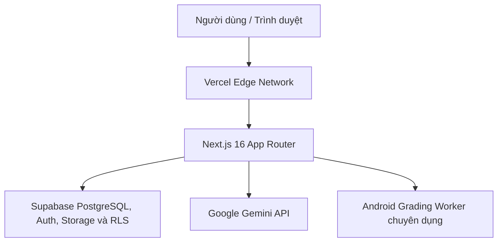

# UIGrade AI Web - Hướng Dẫn Triển Khai Production (Vercel)

Tài liệu này hướng dẫn chi tiết quy trình chuẩn bị, cấu hình và triển khai ứng dụng Web **UIGrade AI** (`web/site`) lên môi trường **Vercel Production**.

---

## 1. Kiến Trúc Hệ Thống (Production Architecture)



- **Web Frontend & API Routes**: Chạy trên **Vercel Serverless Functions**.
- **Dữ liệu, xác thực và phân quyền**: **Supabase PostgreSQL**, Supabase Auth và RLS cho hồ sơ, lớp học, bài tập, bài nộp, điểm số và cấu hình.
- **Lưu trữ tập tin**: **Supabase Storage** cho avatar, tài liệu bài tập và file bài nộp; quyền truy cập được kiểm soát bằng Storage policies.
- **AI Đánh giá giao diện**: **Google Gemini API** (`gemini-3.8-flash`).
- **Android Runtime Runner (Grading Worker)**: Chạy trên máy chủ chuyên dụng (có Android SDK, ADB, Emulator / AVD). **Không chạy trực tiếp bên trong Vercel Serverless Functions**.

---

## 2. Cấu Hình Vercel (Project Settings)

Khi import repository `truong256/UIGrade-AI` vào Vercel Dashboard hoặc liên kết qua Vercel CLI:

| Thiết lập | Giá trị bắt buộc | Ghi chú |
| :--- | :--- | :--- |
| **Framework Preset** | `Next.js` | Tự động nhận diện cấu hình Next.js |
| **Root Directory** | `web/site` | **Quan trọng**: Web nằm trong thư mục con của monorepo |
| **Build Command** | `npm run build` | Thực hiện Next.js production build |
| **Output Directory** | `.next` (mặc định) | Tuyệt đối **không** dùng static export |
| **Install Command** | `npm ci` | Đảm bảo cài đặt đồng nhất với `package-lock.json` |
| **Node.js Version** | `20.x` hoặc `22.x` | Tương thích với dependencies hiện tại |
| **Production Branch**| `main` | Nhận trigger deploy tự động khi có merge vào main |

---

## 3. Danh Sách Biến Môi Trường (Environment Variables)

### A. Biến Công Khai (Public - Trình duyệt truy cập)

Các biến này bắt đầu bằng `NEXT_PUBLIC_` và được nhúng vào client bundle trong quá trình build:

| Tên biến | Ví dụ giá trị | Mô tả |
| :--- | :--- | :--- |
| `NEXT_PUBLIC_APP_URL` | `https://uigrade-ai.vercel.app` | URL chính thức của ứng dụng (không dùng localhost ở production) |
| `NEXT_PUBLIC_SUPABASE_URL` | `https://<project-ref>.supabase.co` | Endpoint Supabase của dự án |
| `NEXT_PUBLIC_SUPABASE_ANON_KEY` | `<supabase-anon-public-key>` | Public Anon Key của Supabase |

### B. Biến Bí Mật Máy Chủ (Server Secrets - Tuyệt đối không để lộ)

Các biến này chỉ được truy cập trong môi trường Server / Serverless API routes:

| Tên biến | Bắt buộc | Mô tả |
| :--- | :---: | :--- |
| `SUPABASE_SERVICE_ROLE_KEY` | **Có cho chức năng quản trị người dùng** | Chỉ đặt trong Vercel server; tuyệt đối không thêm tiền tố `NEXT_PUBLIC_`, không đưa vào client hoặc commit Git |
| `GEMINI_API_KEY` | **Có** | API Key từ Google AI Studio / Google Cloud |
| `GEMINI_MODEL` | Tùy chọn | Mặc định là `gemini-3.8-flash` |
| `NOTIFICATION_CRON_TOKEN` | Tùy chọn | Token bảo vệ endpoint trigger reminder tự động |
| `SMTP_HOST` | Tùy chọn | Host SMTP gửi email thông báo |
| `SMTP_PORT` | Tùy chọn | Port SMTP (587 hoặc 465) |
| `SMTP_USER` | Tùy chọn | Tài khoản gửi mail |
| `SMTP_PASS` | Tùy chọn | Mật khẩu ứng dụng SMTP |
| `SMTP_FROM` | Tùy chọn | Tên người gửi (`UIGrade AI <noreply@domain.com>`) |

---

## 4. Cấu Hình Supabase (PostgreSQL, Auth, Storage và RLS)

Luồng xác thực Email/Google thông thường chỉ dùng URL dự án và Anon Key công khai.
Riêng API quản trị tài khoản cần `SUPABASE_SERVICE_ROLE_KEY` ở server để gọi Supabase
Auth Admin. Mọi route này vẫn phải xác minh session và role `admin` trước khi tạo admin
client; khóa đặc quyền không được gửi xuống trình duyệt.

### A. Authentication URL Configuration
Trong Supabase Dashboard: `Project Settings` → `Authentication` → `URL Configuration`:
1. **Site URL**: Điền Production URL chính thức, ví dụ `https://uigrade-ai.vercel.app`.
2. **Redirect URLs**:
   - `http://localhost:3000/auth/callback`
   - `<VERIFIED_PRODUCTION_ORIGIN>/auth/callback`

`uigrade-ai.vercel.app` trong tài liệu này là ví dụ, chưa được xác minh bằng cấu hình
deployment. Kiểm tra domain thật trong Vercel trước khi đặt Site URL và redirect URL;
không cần wildcard hoặc redirect trực tiếp dashboard cho OAuth.

Google Web OAuth Client: thêm `http://localhost:3000` và origin production đã xác minh
vào Authorized JavaScript Origins. Authorized Redirect URI phải là
`https://plcrwxcwgfcqtfuidloz.supabase.co/auth/v1/callback`.

Google Provider trong Supabase: nhập danh sách `<WEB_CLIENT_ID>,<ANDROID_CLIENT_ID>`
(Web đứng đầu), nhập Web Client Secret trực tiếp trong Dashboard và giữ kiểm tra nonce
bật. Không đưa secret vào Vercel hoặc Android. Android OAuth Client dùng package
`com.uigrade.ai` và SHA-1 thật từ `gradlew.bat signingReport` trên máy developer.

### B. Storage Buckets
Hệ thống sử dụng các bucket Supabase Storage cho tệp tải lên (chạy migration `supabase/migrations/20260828000003_storage_setup.sql`):
- `avatars`: Công khai (Public), giới hạn 5MB (hình ảnh).
- `assignments`: Công khai (Public) hoặc hạn chế, chứa tài liệu bài tập.
- `submissions`: Riêng tư (Private), chứa file mã nguồn `.zip` / `.apk` nộp bởi sinh viên.

---

## 5. Giới Hạn Của Vercel & Worker Android (Known Limitations)

> [!WARNING]
> **Vercel Serverless Functions không hỗ trợ chạy Android Emulator / ADB / Gradle:**
> 1. **Môi trường Serverless không có Android SDK & KVM**: Vercel Functions chạy trên AWS Lambda không hỗ trợ ảo hóa phần cứng (hardware virtualization) để khởi động máy ảo Android (AVD/Emulator).
> 2. **File System Read-Only**: Hệ thống tệp trên Vercel là Read-Only ngoại trừ thư mục `/tmp` (tạm thời, tối đa 512MB-10GB tùy gói và bị xóa khi container tắt).
> 3. **Timeout Giới Hạn**: Serverless function có giới hạn thời gian (10s gói Hobby, tối đa 300s gói Pro). Quá trình build Gradle Android có thể vượt quá giới hạn này.
>
> **Giải pháp kiến trúc**:
> - Vercel chỉ phục vụ Web UI, Authentication, Assignment Management, và AI Rubric Evaluation.
> - Tính năng chạy thử ứng dụng Android thực tế (APK runtime execution & screencap) cần được kích hoạt qua **Dedicated Android Grading Worker** bên ngoài. Khi worker chưa kết nối, hệ thống sẽ thực hiện chấm điểm tĩnh (Static Source Code Analysis) và AI Visual Evaluation dựa trên ảnh chụp được nộp.

---

## 6. Các Bước Triển Khai Thực Tế

### Bước 1: Đăng nhập Vercel CLI trên máy cục bộ
Mở terminal và thực thi:
```bash
vercel login
```
Làm theo hướng dẫn trên trình duyệt để xác thực tài khoản Vercel.

### Bước 2: Liên kết dự án với Vercel
Di chuyển vào thư mục Web và liên kết dự án:
```bash
cd web/site
vercel link
```
- Chọn Vercel Scope của bạn.
- Liên kết với project hiện có hoặc tạo project mới (`uigrade-ai-web`).

### Bước 3: Thiết lập biến môi trường
Thêm các biến môi trường vào Vercel (Production và Preview):
```bash
vercel env add NEXT_PUBLIC_APP_URL production
vercel env add NEXT_PUBLIC_SUPABASE_URL production
vercel env add NEXT_PUBLIC_SUPABASE_ANON_KEY production
vercel env add SUPABASE_SERVICE_ROLE_KEY production
vercel env add GEMINI_API_KEY production
vercel env add GEMINI_MODEL production
vercel env add NOTIFICATION_CRON_TOKEN production
vercel env add SMTP_HOST production
vercel env add SMTP_PORT production
vercel env add SMTP_USER production
vercel env add SMTP_PASS production
vercel env add SMTP_FROM production
```

Lặp lại các biến cần thiết cho môi trường Preview nếu Preview phải kiểm thử đầy đủ.
Không tải trực tiếp toàn bộ tệp `.env.local` lên Vercel; thêm hoặc cập nhật từng biến
để tránh ghi đè nhầm phạm vi Production/Preview.

### Bước 4: Triển khai bản Preview (Kiểm thử)
```bash
vercel
```
Kiểm tra URL preview do Vercel trả về. Thực hiện smoke test toàn bộ các trang công khai và luồng đăng nhập.

### Bước 5: Triển khai bản Production
Khi bản Preview đã đạt 100% tiêu chí kiểm thử:
```bash
vercel --prod
```
Lưu lại URL Production chính thức (ví dụ: `https://uigrade-ai.vercel.app`).

---

## 7. Checklist Kiểm Thử Sau Khi Triển Khai (Smoke Testing)

- [ ] **HTTPS**: Kết nối an toàn, SSL certificate hợp lệ.
- [ ] **Trang Chủ (`/`)**: Giao diện hiển thị đúng font Inter, Material Symbols, bố cục chuẩn.
- [ ] **Đăng Nhập (`/login`)**: Form đăng nhập hoạt động, hiển thị lỗi rõ ràng khi sai thông tin.
- [ ] **Đăng Ký (`/register`)**: Đăng ký sinh viên mới thành công.
- [ ] **Sinh Viên (Student Flow)**:
  - Xem Dashboard tổng quan kết quả.
  - Xem danh sách lớp học và danh sách bài tập.
  - Xem chi tiết bài tập và trang nộp bài.
  - Không có quyền truy cập trang `/ui/server_config` hay `/ui/server_config/users`.
- [ ] **Giảng Viên (Lecturer Flow)**:
  - Tạo / quản lý bài tập.
  - Xem danh sách bài nộp và chấm điểm.
  - Bị chặn (403/redirect) khi truy cập cấu hình hệ thống máy chủ.
- [ ] **Quản Trị Viên (Admin Flow)**:
  - Quản lý người dùng (`/ui/server_config/users`).
  - Cấu hình hệ thống máy chủ (`/ui/server_config`).
- [ ] **RBAC Invariants**: Bảo vệ tài khoản Admin cuối cùng, không thể giả mạo header vai trò.
- [ ] **Layout Consistency**: Footer nằm sát đáy (`min-h-dvh flex flex-col`), không có khoảng trắng lớn dưới footer, không duplicate liên kết "Tài khoản".

---

## 8. Quy Trình Khôi Phục Nhanh (Rollback Plan)

Trong trường hợp bản phát hành mới gặp sự cố nghiêm trọng trên môi trường Production:
1. Mở **Vercel Dashboard** → Chọn dự án `uigrade-ai-web`.
2. Vào tab **Deployments**.
3. Tìm bản deployment gần nhất hoạt động ổn định.
4. Bấm vào menu **`...`** (Tùy chọn) bên phải deployment đó → Chọn **Instant Rollback**.
5. Vercel sẽ chuyển hướng 100% traffic về phiên bản ổn định trong vòng dưới 5 giây mà không cần build lại.
